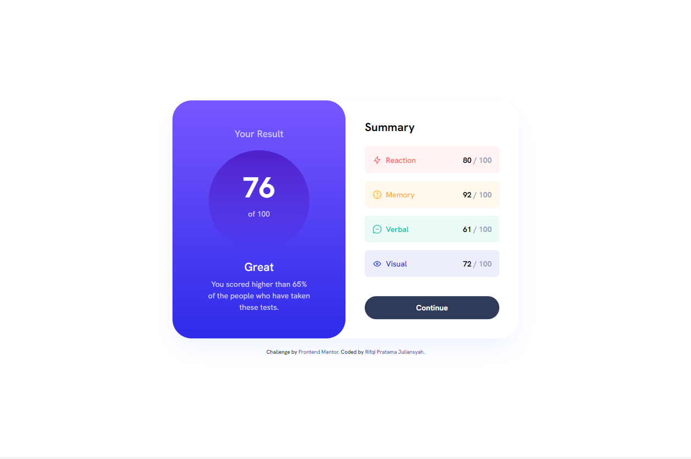

# Frontend Mentor - Results summary component solution

This is a solution to the [Results summary component challenge on Frontend Mentor](https://www.frontendmentor.io/challenges/results-summary-component-CE_K6s0maV). Frontend Mentor challenges help you improve your coding skills by building realistic projects.

## Table of contents

- [Overview](#overview)
  - [The challenge](#the-challenge)
  - [Screenshot](#screenshot)
  - [Links](#links)
- [My process](#my-process)
  - [Built with](#built-with)
  - [What I learned](#what-i-learned)
  - [Useful resources](#useful-resources)
- [Author](#author)

**Note: Delete this note and update the table of contents based on what sections you keep.**

## Overview

### The challenge

Users should be able to:

- View the optimal layout for the interface depending on their device's screen size
- See hover and focus states for all interactive elements on the page

### Screenshot

### Links

- Solution URL: [https://www.frontendmentor.io/challenges/results-summary-component-CE_K6s0maV/hub](https://www.frontendmentor.io/challenges/results-summary-component-CE_K6s0maV/hub)
- Live Site URL: [https://result-summary-component-frontendmentor.vercel.app/](https://result-summary-component-frontendmentor.vercel.app/)
- Repository URL: [https://github.com/juliansyahrifqi/result-summary-component-frontendmentor](https://github.com/juliansyahrifqi/result-summary-component-frontendmentor)

## My process

### Built with

- Semantic HTML5 markup
- Flexbox
- CSS Grid
- Mobile-first workflow
- [Tailwind CSS v3.2.7](https://tailwindcss.com/) - For styling

### What I learned

I'm learned how to build responsive using Tailwind CSS and custome color theme in Tailwind CSS

### Useful resources

- [Tailwind CSS Docs](https://tailwindcss.com/) - This helped me for using Tailwind CSS.

## Author

- Website - [Rifqi Pratama Juliansyah](https://www.rifqipratamaj.me)
- Frontend Mentor - [@juliansyahrifqi](https://www.frontendmentor.io/profile/juliansyahrifqi)
- Twitter - [@juliansyahrifq1](https://www.twitter.com/juliansyahrifq1)
